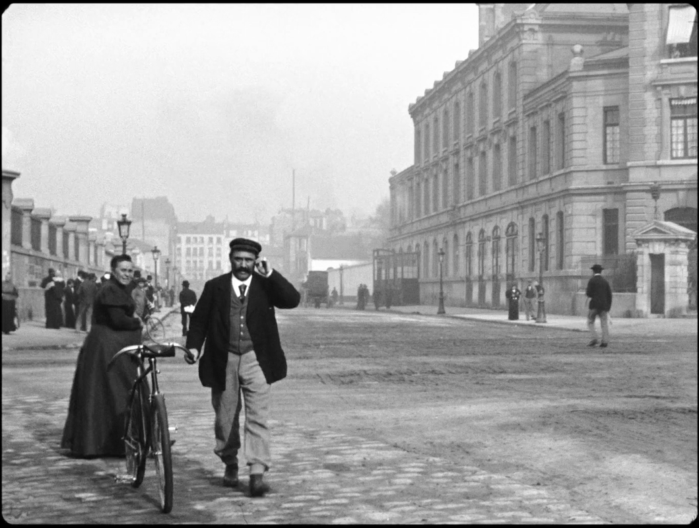
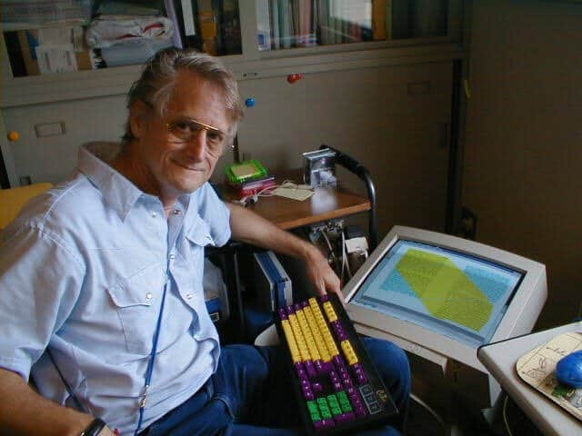

## Arrival of a Train at Ciotat Station

https://www.youtube.com/watch?v=J7laguPTT-Q])

"incunabula"  
cradle films  
a collective invention of a new language  
the montage  
from Paris to the CD-ROM  

